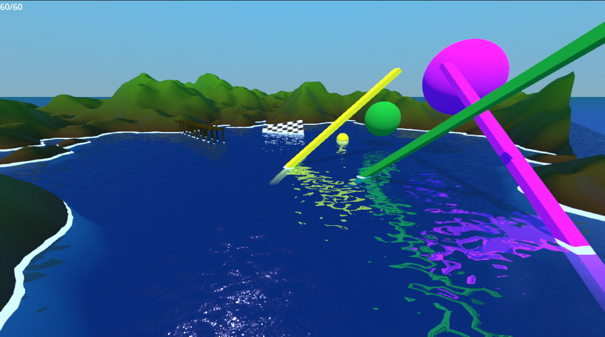

# Godot SSR Water 

## What is this about?

This intends to solve the problem that the SSR (Screen Space Reflection) implementation of Godot 4.X is limited to surfaces that are not transparent. For a water shader it is often necessary to support both transparency and reflections. In a lot of cases this can be worked around with reflection probes, but the need for SSR stands, especially because SSR works quiet well for water. The only solution is to write a custom SSR shader for that matter.

This is a full water shader implementation supporting:

- Screen Space Reflection
- Transparency
- 3D waves
- Edge detection
- Normal textures for a varied surface
- Fake Refraction

This repository includes the shader and a demo scene.

The SSR part of the shader is done in a function of its own, so it should be possible to use the SSR functionality separately.

## Godot Version

Godot 4.2.X (the shader code itself should generally run on all Godot versions 4.0 - 4.2)

## Usage

Load the project in Godot and hit "Run".

Use the shader settings to both change look and performance of the shader. 

Especially the SSR settings have great impact on the shaders performance. In many cases low quality settings might be more than enough (low value distance, high value resolution).

### Shader Settings

| Setting                            | Description |
| --------                           | ------- |
| Albedo                             | The base color of the water surface. |
| Transparency                       | The transparency of the water. |
| Metallic                           | The metallic property of the water. |
| Roughness                          | The roughness property of the water. |
| Surface Normals Move Direction A   | The 2D vector of the Surface Normals A texture. For details on the water surface, |
| Surface Normals Move Direction B   | The 2D vector of the Surface Normals B texture. This is merged with the details from A. |
| Surface Texture Roughness          | How rough the detail normals will look. |
| Surface Texture Scale              | Scale of the texture interpretation. Higher means smaller details.|
| Surface Texture Time Scale         | The speed the details move across the surface. |
| SSR Resolution                     | The distance the ray-marching algorithm moves per step. Smaller values are better but slower. |
| SSR Max Travel                     | The maximum distance the ray will travel before giving up. Longer is better but slower. |
| SSR Max Diff                       | The maximum diff from geometry that is counted as a ray-march hit. No performance impact. Low values might miss geometry, high values might create false positives. Aim for good looks. |
| SSR Mix Strength                   | How visible the reflections are on the surface of the water. |
| Wave Noise Scale                   | Scale of the 3D waves interpretation. Higher means wider waves. |
| Wave Height Scale                  | The y-height of waves interpreted from the wave textures. |
| Wave Time Scale                    | The waves speed. |
| Wave Normal Flatness               | The flatness of the new calculated normals. Higher values are smoother. |
| Border Color                       | The coastal border color. This is the foam around objects in the water. |
| Border Scale                       | The size of the coastal border. |
| Border Near                        | Near plane for linear depth calculation for coastal borders. Good values improve the precision. Should be < Border Far. (Default: 0.5) |
| Border Far                         | Far plane for linear depth calculation for coastal borders. Good values improve the precision depending on your scene scale. Should be > Border Near. (Default: 300.0) |
| Refraction Intensity               | The intensity of the refraction effect. 0 is no refraction at all. |
| Max Visible Depth                  | The max depth that will be visible from the surface. After that it gets opaque. |
| Color Deep                         | The opaque color of depths not visible. |
| Wave A                             | The height texture for the wave layer A. Should be seamless and black and white, can be noise. |
| Wave B                             | The height texture for the wave layer B. Should be seamless and black and white, can be noise. |
| Surface Normals A                  | The normals texture with the surface normals for A. Should be seamless, can be noise. |
| Surface Normals B                  | The normals texture with the surface normals for A. Should be seamless, can be noise.  |

## Performance

Should run well in most cases. I’ve tested it at 60fps on the Steam Deck without any lowering of the SSR resolution or any other optimizing and the demo is out of the box rock steady at 60fps at 50% GPU with 2.3 watts.

(c) Marcel Bankmann 2023 - present
